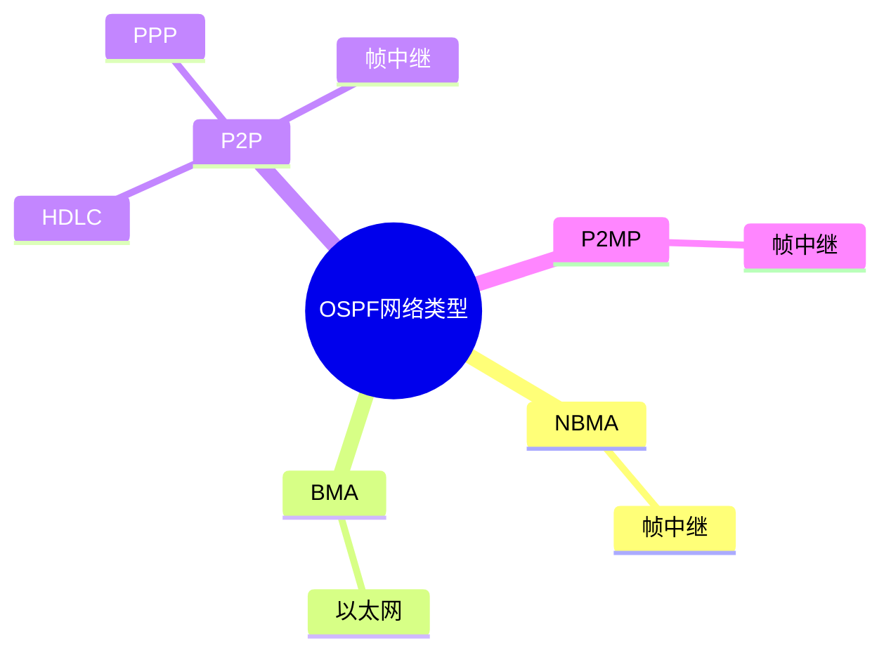

**网络类型及数据链路层协议**





不同的数据链路层协议导致网络类型不同，与此同时，因为数据链路协议不同，物理层设备也不同

数据链路层协议->网络类型，物理层设备


那我们就来了解下**数据链路层的协议**和对应的**网络类型**


先浅浅看一下


局域网我们之前学过，主要看广域网的数据链路层协议PPP和HDLC


可以根据网络类型来进行分类

| 网络类型 | 发送Hello方式 | 邻居发现     | 是否选举DR/BDR | 最适用拓扑        |
| :------- | :------------ | :----------- | :------------: | :---------------- |
| **NBMA** | **单播**      | **手动指定** |      选举      | 全网状            |
| **BMA**  | **组播**      | **自动发现** |      选举      | 全网状            |
| **P2P**  | **组播**      | **自动发现** |     不选举     | 点到点            |
| **P2MP** | **组播**      | **自动发现** |     不选举     | **星型/部分网状** |

### 1、多点接入网络（MA）：一条网段内上出现多个设备

------------------

​	**BMA**：广播型多点接入（broadcast），支持广播，所有设备之间能互访，

​	这对应的数据链路层的协议是**以太网协议**

**（1）以太网协议**

定义：以太网不是一个网络，而是一个协议，传输标准Ethermetl类型帧的网络

特征：多路访问，广播式的网络，需要使用MAC地址对设备进行区分和标识

所属类型：可细分至BMA因为其支持多点接入和广播行为

构建方法：使用以太网线连接设备的以太网接口，形成的网络是以太网络，所运行的二层协议就是以太网协议

以太网线：同轴电缆、光纤、双绞线

以太网接口：设备一般提供百兆、千兆、万兆接口

以太网特色：可以提供极大的传输速率——频分技术：一根铜丝上其实可以同时发送不同频段的电波而互不干扰，实现数据的并行发送，起到暨加带宽的效果。（就是可以同时处理不同应用的数据😎☝️）


------------------------

​	

==严格来说这上下各算一种==


------------------

​	**NBMA**：非广播型多点接入，不支持广播，需要手动指定邻居。例如：帧中继网络（已经没人用了）


用的帧中继协议

​	


图形方面，就是一个交换机连接着一堆路由器，有种一对多的感觉


------------------------


### 2、P2MP（点到多点网络）point-to-Multipoint

特点：模拟组播发送协议报文（帧中继子接口实现的），不需要手动指定邻居。

这个类型还有个特点：**可以由其他网络类型手动更改**

​	也就是说，即使物理底层是“不支持广播”的NBMA网络，但通过把接口类型强行改为“P2MP”，欺骗OSPF协议，让它认为自己是“支持广播”的MA网络，从而自动发现邻居，省去了手动指定邻居的麻烦。(类似于一个套壳？🤔，就是设计出来完爆帧中继的)


协议就不看了，用的MA的套壳而已 


### 3、点到点网络（P2P）point-to-point

特点：一个网络中只有两台设备

 点到点网络的搭建：使用串线连接设备的串线接口（serial），形成一个P2P网络（就是之前的物理层设备对应网络类型）

串线：VAG视频线、console配置线


**(1)  HDLC协议**，High-Level Data Link Control——高级数据链路控制协议。

​	这是私有协议，厂商之间不兼容。

​	分类：

​		标准HDLC：ISO组织根据SDLC（面向比特的同步数据链路控制协议）发展改进而来

​		非标准HDLC：各个厂家在ISO标准的HDLC上再进行修改而成


​	**HDLC特点：**

​		1、对于任何一种比特流都可透明传输

​		2、较高的数据链路传输效率（其实一般）

​		3、所有的帧都有FCS，传输可靠性高

​		4、用统一的帧格式 来实现传输

​		5、不支持验证，缺乏足够的安全性

​		6、协议不支持IP地址协商

​		7、用于点到点的同步链路


就是个被思科淘汰的协议。。。


了解即可：SLARP（Serial LineAddress ResolutionProtocol，串行线路地址解析协议）是Cisco私有的一种协议，专门运行在Cisc的HDLCI（高级数据链路控制协议）封装之上。作用：链路保活（Keepalive）检测：通过周期性的"心跳消息检测链路状态，判断对方是否在线。

------------------


**(2)  PPP协议**，point to point protocol——点到点协议


**基本概念：**

​	ppp协议，公有协议，所有厂商兼容，支持同步和异步线路

​		同步、异步本质区别：所有电路是否在同一时钟沿下同步地处理数据。（解释一下，就是数据被切成小块发过来时，同步会等所有小包到了之后再处理，而异步则是谁先到处理谁，最后全部处理完😵**不太对劲**）


PPP特点：

​	1、直连间配置不同网段IP地址可以正常通信

​	2、ppp协议支持验证，具备错误检测能力，但不具备纠错能力

​	3、对网络层地址进行协商，能够远程动态分配IP地址；（一侧给另一侧设备分配IP地址）

```
[R1-Serial3/0/0]ip address ppp-negotiate 
被分配IP地址的端要开启地址协商功能

[R2-Serial3/0/0]remote address 1.0.0.2
给被分配IP的端一个地址
```

​	4、PPP兼容较好，可同时支持多种网络层协议

​	5、无重传机刺，网络开销小


**PPP数据帧结构**：（了解）


Flag：固定长度8位，固定取值：0X7E，标识一个物理帧的起始和结束，该字节为二进制序列0111110(0X7E)

address：固定长度8位，固定取值：0XFF，该字节二进制为11111111（0XFF），是一个广播地址，默认指目标MAC地址

control：固定长度8位，固定取值：0X03，该字节二进制为00000011（0X03），表明为无序号帧。这种帧用于在无连接、不可靠的模式下传输数据，不进衍序列号和确认，为了兼容HDLC协议，没啥实际意义。

protocol：协议字段，表明其信息部分所采用的协议类型（LCPNCP）

mfomaion：数据

​	Code：标识不同类型LCP报文，
​	Identifier：标识，为1个字节，用来匹配请求和咱应。

​	Length：就是该LCP报文的总字节数据。

​	Data：承载各种TLV（Type/LengthValue）参数用于协商配置选项，包括最大接收单元（MRU=MTU)，认证协议，魔术字等。

魔术字：检测链路环路和其他异常情况。魔术字是随机产生的一个数字，随机机制需要保证两端产生相同魔术字的可能性几乎为0。

FCS：帧校验序列确保数据完整性


注：思科设备默认采用的串线协议是HDLC，华为设备默认采用PPP协议

------------------


先看配置


学着操作一下

```
[Huawei]interface Serial 3/0/0
[Huawei-Serial3/0/0]link-protocol hdlc 

两边接口下修改链路协议为hdlc
```


